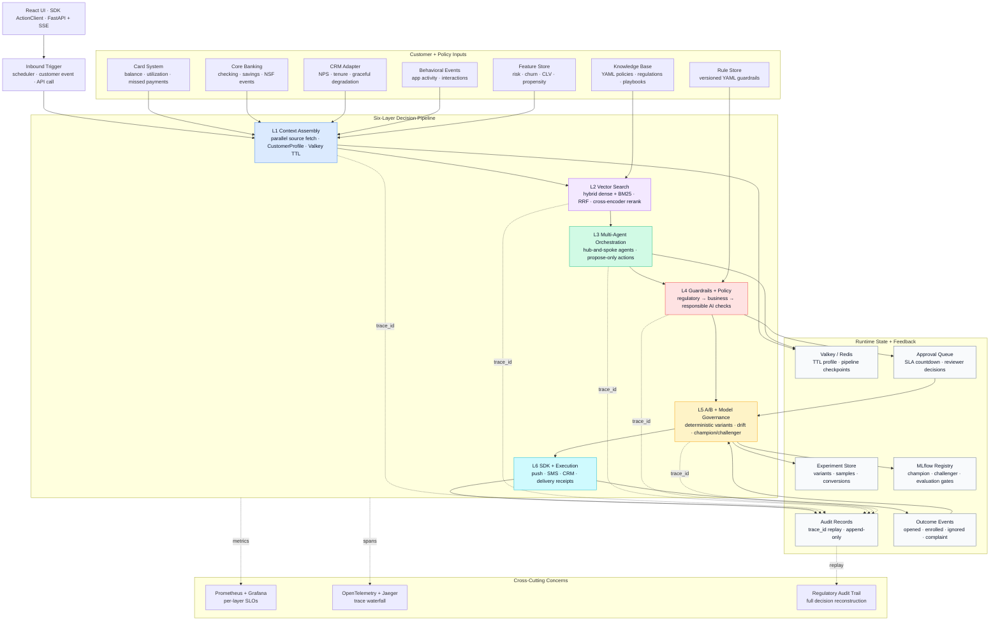

# Banking Agentic AI Platform

**Author:** Sarala Biswal &nbsp;·&nbsp; [LinkedIn](https://linkedin.com/in/saralabiswal) &nbsp;·&nbsp; [GitHub](https://github.com/saralabiswal)

[](https://python.org)
[](https://fastapi.tiangolo.com)
[](https://react.dev)
[](LICENSE)
[](#quick-start)

---

A **cloud-agnostic, production-grade Agentic AI platform** for banking decisions.
Six governed layers — from live customer context to executed action — with regulatory
replay, A/B experimentation, drift monitoring, and a live architecture diagram.

> Built as a reference implementation of the engineering patterns that make agentic AI
> trustworthy at enterprise scale: typed contracts between layers, runtime governance
> before execution, deterministic experimentation, and an immutable audit trail that
> reconstructs every decision from one `trace_id`.

---

## Table of Contents

- [What Makes This Different](#what-makes-this-different)
- [The Business Problem](#the-business-problem)
- [Architecture](#architecture)
- [Six-Layer Decision Pipeline](#six-layer-decision-pipeline)
- [Cross-Cutting Concerns](#cross-cutting-concerns)
- [Quick Start](#quick-start)
- [Running the Platform](#running-the-platform)
- [Technology Stack](#technology-stack)
- [UI Pages](#ui-pages)
- [LLM Configuration](#llm-configuration)
- [Project Structure](#project-structure)
- [Contributing](#contributing)

---

## What Makes This Different

| Capability | What it means in practice |
|------------|---------------------------|
| **Architecture-as-code** | Every layer has typed schemas, runtime services, integration tests, and UI visibility — not just documentation |
| **Live architecture diagram** | `/architecture` animates the six-layer pipeline in real time from SSE events as each layer completes |
| **No API key required** | Default mock LLM exercises all downstream logic — guardrails, experiments, drift, audit — without any cloud dependency |
| **Regulatory replay** | One `trace_id` reconstructs customer context, policy retrieved, compliance checks run, action taken, and customer outcome |
| **Runtime governance** | Guardrails run *before* execution — not as a post-hoc audit — with a versioned YAML rule store and SLA-backed approval queue |
| **Feedback loop** | Outcome events feed Layer 5 so interventions improve over time without bypassing compliance |

---

## The Business Problem

Banks hold enough customer data to intervene before a customer misses a payment,
churns, or disputes a charge. Most AI systems fail to act on it because they combine
three problems:

**Stale batch context** — Nightly risk scores reflect yesterday's account state, not
this morning's transaction. An agent acting on stale data produces decisions that feel
wrong to the customer even when the model is technically correct.

**Ungoverned agent execution** — An agent that executes directly — send a push,
modify a rate, create a case — has no compliance gate. One misconfigured prompt or
injected instruction can trigger a customer-facing action that violates CFPB, ECOA,
or UDAAP requirements.

**No feedback loop** — An intervention that fires has no mechanism to measure whether
it worked, which variant performed better, or whether the underlying model is drifting.
Without outcome capture, there is no learning.

This platform separates those concerns into six layers, each solving one problem,
composable by any product team through a stable SDK.

---

## Architecture

See [`docs/logical-architecture.md`](docs/logical-architecture.md) for the full
platform runtime view: service boundaries, data flows, governance checkpoints,
state stores, and feedback loop.


### Logical Architecture Diagram



### Platform Overview

```
Product Teams / Operators
        │
        ▼
┌─────────────────────────────────────────────────────────┐
│  React UI  ·  SDK ActionClient  ·  FastAPI + SSE        │
└──────────────────────────┬──────────────────────────────┘
                           │  Blueprint Runner
                           ▼
┌─────────────────────────────────────────────────────────┐
│  L1  Context Assembly   ←── Card, Banking, CRM,         │
│      TTL profile write       Behavioral, Feature Store  │
│                                                         │
│  L2  Vector Search      ←── Knowledge Base (YAML)       │
│      Hybrid dense+BM25                                  │
│      Cross-encoder rerank                               │
│                                                         │
│  L3  Orchestration      ←── LLM (Mock / Ollama / API)   │
│      Hub-and-spoke agents                               │
│      Propose-only actions                               │
│                                                         │
│  L4  Guardrails         ←── Rule Store (versioned YAML) │
│      REGULATORY→BUSINESS→AI                             │
│      Block / Flag / Approve queue                       │
│                                                         │
│  L5  A/B + Model Gov.   ←── Experiment Store, MLflow    │
│      Deterministic variant assignment                   │
│      Drift detection + champion/challenger              │
│                                                         │
│  L6  Execution          ──► Push, SMS, CRM adapters     │
│      Delivery receipts                                  │
│      Outcome capture → feedback loop                    │
└─────────────────────────────────────────────────────────┘
        │ every layer writes to │
        ▼                       ▼
  Audit Records           Observability
  (trace_id replay)       (Jaeger, Prometheus, Grafana)
```

### Key Architectural Boundaries

| Boundary | Responsibility | Why It Exists |
|----------|----------------|---------------|
| **Layer 1 context boundary** | Source adapters normalize all upstream data into one `CustomerProfile` | Agents never depend on upstream system schemas — they degrade gracefully when sources fail |
| **Layer 3/4 governance boundary** | Agents propose actions; guardrails authorize actions | Prevents LLM prompt behavior from becoming the control plane |
| **Layer 5/6 execution boundary** | Experiments tag approved actions before delivery | Keeps measurement and execution coupled but independently auditable |
| **Audit/observability boundary** | Audit proves decisions; metrics/traces operate the system | Separates regulatory replay from engineering telemetry |

---

## Six-Layer Decision Pipeline

### Layer 1 — Context Assembly

Assembles a unified `CustomerProfile` from multiple source systems in parallel.
Source failures degrade safely: a CRM timeout marks `sources_degraded: ["crm"]`
and the pipeline continues with the available data.

- Parallel async fetch with 150ms per-adapter hard timeout
- Schema normalization: raw source fields → canonical `CustomerProfile`
- Feature store merge: live transactional data + pre-computed model signals
- Writes to Valkey with `EX=300, NX=True` — immutable for the session lifetime
- Writes an immutable audit record including profile hash and model versions used

### Layer 2 — Vector Search

Builds a scenario-aware query from the assembled profile and retrieves the
most relevant policy chunks from the knowledge base.

- Dynamic query construction from customer risk signals (not a static prompt)
- Hybrid retrieval: dense (sentence-transformers) + sparse (BM25) merged with RRF
- Metadata pre-filter by `product_line` and `jurisdiction` before ANN search
- Cross-encoder reranking on top-20 candidates → top-3 policy chunks returned
- KB version tracked in audit record for regulatory replay

### Layer 3 — Multi-Agent Orchestration

Routes work through a hub-and-spoke orchestrator. Agents never call each other
directly. Tool authorization is enforced in code before any tool call executes.

- Static pipeline definitions with conditional branches
- `RiskScoringAgent` → `InterventionAgent` (or scenario-specific equivalents)
- Agents receive typed `AgentContext`: customer profile + policy chunks + prior outputs
- All agent outputs validated against Pydantic schemas before routing downstream
- Failures (timeout, schema error, tool auth violation) route to `HumanReviewQueue`
- Pipeline state checkpointed to Valkey after each step for recovery

### Layer 4 — Guardrails & Policy Enforcement

Every proposed action passes through three check categories in strict sequence
before any execution is authorized.

- **REGULATORY** checks run first — any failure blocks immediately, no further checks
- **BUSINESS POLICY** checks — configurable YAML rules, hot-reloaded without restart
- **RESPONSIBLE AI** checks — confidence thresholds, fairness (BISG/AIR), consistency
- Flagged actions enter an SLA-backed approval queue with escalation ladders
- Rule store is versioned: `rule_id + version` recorded in every audit entry
- Reviewer decisions feed back to Layer 5 for model calibration

### Layer 5 — A/B Evaluation & Model Governance

Assigns experiment variants deterministically and provides the model governance
infrastructure that keeps the platform's intelligence current.

- Hash-based variant assignment: `hash(customer_id + experiment_id) % 100`
  — the same customer always sees the same variant, enabling clean measurement
- Variant conclusions require both statistical significance (p < 0.05) and
  minimum sample size
- Three-type drift detection: feature drift (KS test), prediction drift (PSI),
  performance drift (rolling 30-day recall)
- Champion/Challenger deployment: new models serve 5% of traffic before promotion
- MLflow model registry: every version tagged with evaluation gate results

### Layer 6 — SDK Surface & Execution

The product-team interface. Product teams consume all six layers through
a stable SDK without building any pipeline logic themselves.

- Blueprint catalog: `PAYMENT_RISK_INTERVENTION`, `BILLING_DISPUTE_RESOLUTION`,
  `CHURN_PREVENTION`, `FRAUD_ALERT`
- Channel adapters: mock push/SMS/CRM in local mode; swappable in production
- Execution returns `outcome_tracking_id` for async outcome capture
- Outcome events (PUSH_OPENED, ENROLLED, IGNORED) feed back to Layer 5
- Full `trace_id` threading from context assembly through outcome capture

---

## Cross-Cutting Concerns

### Observability

Three separate systems for three separate audiences:

| System | Audience | Tooling | Retention |
|--------|----------|---------|-----------|
| **Metrics** | On-call engineers | Prometheus + Grafana | 7 days |
| **Distributed traces** | Debugging engineers | OpenTelemetry + Jaeger | 30 days |
| **Audit trail** | Compliance, legal, regulators | PostgreSQL + append-only writer | Permanent |

The `trace_id` generated at Layer 1 entry threads through every span, log line,
audit record, queue item, and outcome event. One ID reconstructs the complete
customer journey.

### MLOps & Drift Detection

- Feature store as single source of truth — eliminates training/serving skew
- Signal-based retraining triggers (PSI, recall degradation, AIR drift)
- Evaluation gate: accuracy + fairness (AIR ≥ 0.80) + segment regression
- Model cards required per version — compliance artifact, not engineering artifact

---

## Quick Start

No API key required. Runs entirely locally.

```bash
git clone <repository-url>
cd banking-agentic-platform

make install        # uv sync + pnpm install in ui/
make docker-up      # starts all 7 local services

cp .env.example .env
make migrate        # run Alembic migrations

make demo
# Runs Marcus Webb (C002) through payment risk intervention
# All 6 layers execute with mock LLM
# Audit trail printed to console
```

Start the full API and UI:

```bash
make dev
# API: http://localhost:8000
# UI:  http://localhost:5173
```

**Local services started by `make docker-up`:**

| Service | URL | Purpose |
|---------|-----|---------|
| Valkey | `localhost:6379` | TTL session context store |
| PostgreSQL | `localhost:5432` | Audit log, feature store, experiments |
| Qdrant | `localhost:6333` | Vector store for knowledge base |
| Jaeger | `localhost:16686` | Distributed trace visualization |
| Prometheus | `localhost:9090` | Metrics collection |
| Grafana | `localhost:3000` | Metrics dashboards (admin/admin) |
| MLflow | `localhost:5001` | Model registry + experiment tracking |

---

## Running the Platform

### Demo

```bash
make demo
# Default: C002 (Marcus Webb), payment_risk_intervention, mock LLM

python -m platform.demo --customer C001 --scenario churn_prevention
python -m platform.demo --customer C003 --scenario billing_dispute_resolution
```

### Available Make Targets

```bash
make install      # install Python + UI dependencies
make dev          # start all services + API + UI hot-reload
make demo         # run standalone C002 pipeline demo
make test         # full pytest suite with coverage
make test-unit    # unit tests only (no containers)
make test-int     # integration tests (testcontainers)
make typecheck    # mypy (Python) + tsc (TypeScript)
make lint         # ruff + eslint
make format       # ruff format + prettier
make docker-up    # start all 7 Docker services
make docker-down  # stop all services
make migrate      # run Alembic database migrations
```

---

## Technology Stack

| Layer | Technology | Role |
|-------|-----------|------|
| **Backend** | Python 3.12, FastAPI, Pydantic v2, asyncio | API, pipeline orchestration, typed schemas |
| **Context store** | Valkey (Redis-compatible, Apache 2.0) | TTL customer profiles, pipeline state |
| **Relational store** | PostgreSQL 16 | Audit log, feature store, experiments, queue |
| **Vector store** | Qdrant | Knowledge base embeddings and hybrid retrieval |
| **Embeddings** | sentence-transformers (`all-MiniLM-L6-v2`) | Dense vectors; no API key required |
| **Sparse retrieval** | rank_bm25 | BM25 term matching for hybrid search |
| **LLM** | Mock (default) · Ollama · LiteLLM | Agent reasoning; mock exercises all platform logic |
| **Model registry** | MLflow | Champion/challenger tracking, experiment metadata |
| **Drift monitoring** | Evidently | PSI, KS test, drift reports |
| **Observability** | structlog · OpenTelemetry · Prometheus | Structured logs, distributed traces, SLO metrics |
| **Frontend** | React 18, TypeScript, Vite, TanStack Query, Zustand | UI shell, live SSE updates, state management |
| **UI components** | Tailwind CSS, React Flow, Recharts, lucide-react | Styling, architecture diagram, charts, icons |
| **Testing** | pytest, pytest-asyncio, testcontainers | Unit, integration, Playwright smoke checks |
| **Infra** | Docker Compose, Alembic | Local service orchestration, DB migrations |

All dependencies are open source. No proprietary cloud SDK required to run.

---

## UI Pages

| Route | Page | Purpose |
|-------|------|---------|
| `/about` | About | Business problem, architecture narrative, design principles |
| `/` | Pipeline Runner | Trigger runs, watch live layer-by-layer execution log |
| `/architecture` | Architecture View | Animated 6-layer diagram; drill into problem, decisions, last run per layer |
| `/audit/:traceId` | Audit Trail | Full timeline with regulatory replay (8 audit record types) |
| `/experiments` | Experiments | A/B variant stats, statistical significance, conversion charts |
| `/drift` | Drift Monitor | PSI trend with thresholds, three-type drift breakdown, Evidently report |
| `/guardrails` | Guardrails | Rule store viewer, approval queue with SLA countdown, compliance context |
| `/models` | Model Registry | Champion/challenger status, evaluation gate results, traffic split |
| `/settings` | Settings | Runtime LLM switching (Mock → Ollama → API) without server restart |

---

## LLM Configuration

The platform runs fully without an API key. Switch modes from `/settings` in the UI
or via `.env`.

| Mode | Config | Notes |
|------|--------|-------|
| **Mock** (default) | `LLM_BACKEND=mock` | Scripted realistic responses. Exercises all downstream logic. No dependency. |
| **Ollama** | `LLM_BACKEND=ollama` | Real local inference. Free. No account. Requires `ollama pull llama3.2`. |
| **API** | `LLM_BACKEND=api` + key | Production-quality reasoning. Supports Claude, GPT-4o, and 100+ providers via LiteLLM. |

Runtime switching via `/settings` updates the in-memory config for the current
server process — no restart, no `.env` file writes, no API keys stored in the browser.

---

## Project Structure

```
banking-agentic-platform/
│
├── platform/                    # Python backend
│   ├── core/                    # Shared schemas, interfaces, exceptions, config
│   ├── adapters/                # Infrastructure adapter implementations
│   ├── layer1_context/          # Context Assembly service + source adapters
│   ├── layer2_vector/           # Vector Search service + KB loader
│   ├── layer3_orchestration/    # Orchestrator + agents + tool registry
│   ├── layer4_guardrails/       # Guardrails service + rule engine + approval queue
│   ├── layer5_ab/               # A/B service + drift monitor + model registry
│   ├── layer6_sdk/              # SDK client + blueprints + channel adapters
│   ├── api/                     # FastAPI application + routers + SSE
│   ├── observability/           # structlog, OpenTelemetry, Prometheus wiring
│   └── demo.py                  # Standalone pipeline demo script
│
├── ui/                          # React + TypeScript frontend
│   └── src/
│       ├── pages/               # One file per UI route
│       ├── architecture/        # Architecture View components (React Flow)
│       ├── components/          # Shared components
│       ├── hooks/               # SSE hook, Zustand pipeline store
│       └── api/                 # Typed API client
│
├── knowledge_base/              # Policy YAML documents (indexed into Qdrant)
├── rules/                       # Guardrail rule store (versioned YAML)
├── docs/                        # Architecture docs and diagrams
├── tests/                       # Unit + integration test suites
├── alembic/                     # Database migrations
├── docker-compose.yml           # All 7 local services
├── pyproject.toml               # Python dependencies + tool config
└── Makefile                     # All development commands
```

---

## Contributing

Read `AGENTS.md` and the relevant section of `docs/architecture.md` before
modifying any layer. The architecture document is the ground truth for field names,
schema definitions, and design decisions — code must trace back to it.

**Standards:**
- Type hints on every function signature
- Docstrings on every public class and method
- Interface (`Protocol`) for every external dependency
- `structlog` for all logging — `trace_id` in every log line
- Async throughout — no sync I/O in business logic
- Test file alongside every new module

---

*Banking Agentic AI Platform — Reference Implementation*
*Author: Sarala Biswal*
