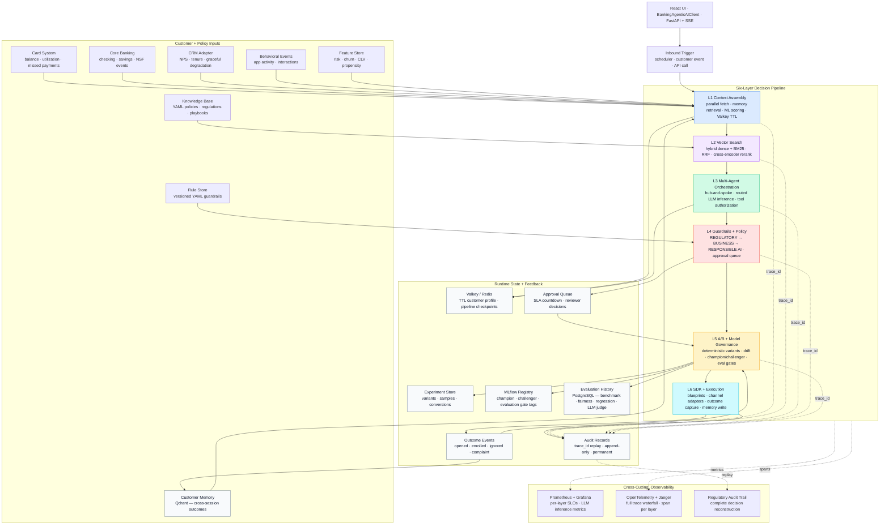

# Banking Agentic AI Platform

**Author:** Sarala Biswal &nbsp;·&nbsp; [LinkedIn](https://linkedin.com/in/saralabiswal) &nbsp;·&nbsp; [GitHub](https://github.com/saralabiswal)

[](https://python.org)
[](https://fastapi.tiangolo.com)
[](https://react.dev)
[](https://pytest.org)
[](LICENSE)
[](#quick-start)

---

A **production-grade, cloud-agnostic Agentic AI platform** for banking decisions — built as a reference implementation of the engineering disciplines that separate trustworthy AI infrastructure from demos that don't survive contact with production.

Ten platform capabilities across eight services — live customer context, two-tier memory, artifact-backed ML scoring, hybrid vector retrieval, routed LLM inference, runtime guardrails, deterministic A/B experimentation, offline model evaluation, regulatory audit replay, and a closed feedback loop — composable by any product team through a stable SDK.

> **Architectural thesis:** The engineering problems that make agentic AI fail in production are not model problems. They are infrastructure problems — stale context, ungoverned execution, absent memory, unvalidated models, and no feedback path from outcome back to decision. This platform solves each of those problems as a named, typed, independently testable layer with a clean contract to its neighbors.

---

## Table of Contents

- [Architectural Principles](#architectural-principles)
- [The Business Problem](#the-business-problem)
- [Platform Architecture](#platform-architecture)
- [Architectural Boundaries](#architectural-boundaries)
- [Six-Layer Decision Pipeline](#six-layer-decision-pipeline)
- [Cross-Cutting Platform Concerns](#cross-cutting-platform-concerns)
- [Quick Start](#quick-start)
- [Running the Platform](#running-the-platform)
- [Technology Stack](#technology-stack)
- [UI Pages](#ui-pages)
- [LLM Configuration](#llm-configuration)
- [Testing and Coverage](#testing-and-coverage)
- [Project Structure](#project-structure)
- [Code Calling Guide](#code-calling-guide)
- [Contributing](#contributing)

---

## Architectural Principles

Every design decision in this platform follows from six principles applied without exception. Understanding them explains why the architecture looks the way it does.

**1. Typed contracts at every boundary.**
Every layer produces and consumes Pydantic v2 schemas. No dicts, no untyped kwargs, no implicit contracts. A `CustomerProfile` leaving Layer 1 is the same `CustomerProfile` arriving at Layer 3 — the schema is the contract, and the contract is enforced at runtime. When a schema changes, the type checker catches it before the test runner does.

**2. Protocol-based dependency injection throughout.**
Every external dependency — LLM, vector store, relational database, cache, audit log — sits behind a `Protocol` interface defined in `platform/core/interfaces.py`. Services receive their dependencies through constructors, never through module-level imports or global state. This makes every service independently testable with lightweight mocks and every dependency swappable without touching business logic.

**3. Graceful degradation over hard failure.**
A source adapter that times out marks `sources_degraded: ["crm"]` and the pipeline continues. An unavailable memory store returns an empty memory list. A failing ML scoring service falls back to feature store signals. The platform records what was missing and proceeds — because a decision made on incomplete data with that fact logged is better than a decision not made. No production system has perfect availability.

**4. Governance as a runtime capability, not a post-hoc audit.**
Layer 4 Guardrails run before Layer 6 executes. This is not a stylistic choice — it is an architectural invariant. An agent that proposes an action and an authorization layer that approves or blocks that action are different systems with different trust models. Mixing them produces agents that are only safe when the model is well-behaved. Separating them produces agents that are safe regardless of what the model outputs.

**5. Immutable, replayable audit trail by design.**
The `trace_id` generated at Layer 1 entry propagates to every span, log line, audit record, queue item, and outcome event. A single `trace_id` can reconstruct: the exact customer context assembled, which memory records were retrieved, which policy chunks were retrieved and from which KB version, what the agent proposed and why, which guardrail rules ran and from which rule version, which experiment variant was assigned, what action was taken, and what the customer did afterward. This is not observability — it is regulatory infrastructure.

**6. Closed feedback loop from outcome to future decision.**
An intervention that fires has two feedback paths: it updates the experiment store for A/B measurement, and it writes a `CustomerMemory` record for retrieval in future sessions. The next time this customer enters the pipeline, Layer 1 retrieves their prior outcomes and the agent reasons with that history in context. Without this, the platform re-learns what it already knows at the cost of every customer interaction.

---

## The Business Problem

Banks hold enough customer data to intervene before a customer misses a payment, churns, or disputes a charge. Most AI systems fail to act on it reliably because they accumulate three architectural deficits:

**Stale batch context.** Nightly risk scores reflect yesterday's account state. An agent acting on a risk score computed 18 hours ago on a customer who just overdrafted this morning produces a decision that is technically correct according to the model but wrong in the world. The customer feels that wrongness immediately. Rebuilding trust after a mistimed intervention costs more than the intervention would have saved.

**Ungoverned agent execution.** An agent that executes directly — sends a push notification, modifies an interest rate, creates a service case — has no compliance gate between its reasoning and its action. One misconfigured prompt, one injected instruction, one edge case the model was not trained on, and the agent fires a customer-facing action that violates CFPB, ECOA, or UDAAP requirements. In a regulated environment, this is not a product risk — it is a legal one.

**No closed-loop governance.** An intervention that fires has no durable path to measure whether it worked, whether prior interactions with this customer should have changed the decision, which model variant performed better, whether the agent's reasoning stayed within the policy rubric, or whether the underlying model is drifting on a segment it was not validated against. Without outcome capture, memory, and evaluation history, the platform learns nothing across sessions. It restarts blind every time.

This platform addresses each deficit as a named architectural layer with an explicit contract, not as a configuration option layered on top of a monolithic agent.

---

## Platform Architecture

See [`docs/logical-architecture.md`](docs/logical-architecture.md) for the full platform runtime view: service boundaries, data flows, governance checkpoints, state stores, and feedback loop.

### Logical Architecture Diagram



### Platform Overview

```
Product Teams / Operators
        │
        ▼
┌─────────────────────────────────────────────────────────┐
│  React UI  ·  BankingAgenticAIClient  ·  FastAPI + SSE  │
└──────────────────────────┬──────────────────────────────┘
                           │  Blueprint Runner
                           ▼
┌─────────────────────────────────────────────────────────┐
│  L1  Context Assembly   ←── Card, Banking, CRM,         │
│      Parallel fetch          Behavioral, Feature Store  │
│      Long-term memory        Customer Memory (Qdrant)   │
│      ML scoring overlay      scikit-learn artifacts     │
│      Valkey TTL write        Graceful degradation       │
│                                                         │
│  L2  Vector Search      ←── Knowledge Base (YAML)       │
│      Hybrid dense+BM25       sentence-transformers      │
│      RRF fusion              rank_bm25                  │
│      Cross-encoder rerank    Qdrant                     │
│                                                         │
│  L3  Multi-Agent        ←── LLM Inference Service       │
│      Orchestration           Task routing + budgets     │
│      Hub-and-spoke           Timeout/fallback metadata  │
│      Propose-only actions    Tool authorization         │
│                                                         │
│  L4  Guardrails         ←── Rule Store (versioned YAML) │
│      REGULATORY first        Hot-reload without restart │
│      BUSINESS second         CFPB · ECOA · UDAAP        │
│      RESPONSIBLE AI third    Fairness (BISG/AIR)        │
│      Approval queue          SLA countdown + escalation │
│                                                         │
│  L5  A/B + Model Gov.   ←── Experiment Store            │
│      Deterministic hash      MLflow registry            │
│      Variant assignment      Evaluation history (PG)    │
│      Drift detection         Offline eval gates         │
│      Champion/challenger                                │
│                                                         │
│  L6  SDK + Execution    ──► Push · SMS · CRM adapters   │
│      Blueprint catalog       Delivery receipts          │
│      Outcome capture         Feedback → L5 + Memory     │
└─────────────────────────────────────────────────────────┘
        │ every layer writes to │
        ▼                       ▼
  Audit Records (permanent)   Observability
  trace_id replay             Jaeger · Prometheus · Grafana
```

---

## Architectural Boundaries

Four explicit boundaries define where one concern ends and another begins. Each boundary is enforced in code, not by convention.

| Boundary | Responsibility | Architectural Rationale |
|----------|----------------|------------------------|
| **L1 context boundary** | Source adapters normalize all upstream data into one `CustomerProfile`, including memory retrieval and ML scoring overlays | Agents never depend on upstream system schemas. A CRM schema change requires updating one adapter — not every agent prompt that ever referenced a CRM field |
| **L3 / L4 governance boundary** | Agents propose actions; guardrails authorize or block them | Prevents LLM output from becoming the control plane. An agent that also enforces its own constraints is safe only when the model is well-behaved. These trust models must be separate |
| **L5 / L6 execution boundary** | Experiment variants are assigned and tagged before delivery | Keeps measurement and execution coupled — the same record knows what was sent and what experiment it belonged to — while keeping them independently auditable |
| **Audit / observability boundary** | Audit proves decisions happened as recorded; metrics and traces operate the system | Separates the regulatory chain of custody (permanent, append-only, forensic) from the engineering telemetry (bounded retention, operational). Conflating them contaminates both |

---

## Six-Layer Decision Pipeline

### Layer 1 — Context Assembly

**Purpose:** Produce a single authoritative `CustomerProfile` that every downstream layer can trust — assembled live, not cached from batch.

The context boundary is the most important boundary in the platform. Everything a downstream agent knows about a customer flows through here. If this layer is wrong or stale, every downstream decision is wrong or stale — and the model cannot fix it.

- **Parallel async fetch** with 150ms per-adapter hard timeout across Card, Banking, CRM, and Behavioral adapters simultaneously — not sequentially
- **Schema normalization**: raw source-specific fields → canonical `CustomerProfile` via typed adapter contracts
- **Long-term memory retrieval**: semantic search against the `customer_memory` Qdrant collection retrieves cross-session history — prior interventions, outcomes, stated preferences, resolved disputes — and populates `CustomerProfile.long_term_memory`
- **Artifact-backed ML scoring**: scikit-learn `GradientBoostingClassifier` artifacts (trained and registered in MLflow) overlay `risk_score` and `churn_probability` signals on the assembled profile; model versions recorded in the audit entry for regulatory replay
- **Feature store merge**: pre-computed CLV and propensity signals combined with live transactional data
- **Valkey write**: assembled profile written with `EX=300, NX=True` — immutable for the session, consistent across all agents in the pipeline
- **Graceful degradation**: any failing source marks `sources_degraded` and the pipeline continues; memory or ML scoring failures fall back to feature store signals without failing the request

### Layer 2 — Vector Search & Policy Retrieval

**Purpose:** Retrieve the policy context that should govern this specific customer's scenario — not a generic policy document, but the most relevant chunks given this customer's actual risk signals.

- **Dynamic query construction** from customer risk signals — the query is derived from the `CustomerProfile`, not hardcoded per scenario
- **Hybrid retrieval**: dense semantic search (`sentence-transformers/all-MiniLM-L6-v2`) fused with BM25 sparse retrieval via Reciprocal Rank Fusion — captures both semantic relevance and exact term matches
- **Metadata pre-filter** by `product_line` and `jurisdiction` before approximate nearest neighbor search — narrows the candidate set before the expensive reranking step
- **Cross-encoder reranking**: top-20 candidates re-scored with a cross-encoder for precision → top-3 policy chunks returned
- **KB version tracking**: knowledge base version recorded in the audit entry — regulatory replay can reconstruct the exact policy context that governed a decision made 18 months ago

### Layer 3 — Multi-Agent Orchestration

**Purpose:** Route customer context through specialized agents that reason about the scenario and produce a proposed action — without giving any agent the ability to execute that action directly.

The propose-only constraint is an architectural invariant. An agent's job is to reason and recommend. A separate layer's job is to authorize. Conflating the two is the source of most agentic AI safety failures in production.

- **Hub-and-spoke topology**: the Orchestrator routes to specialized agents; agents never call each other directly; all inter-agent communication passes through the hub where policy can be observed and logged
- **Typed `AgentContext`**: each agent receives a typed context object containing `CustomerProfile`, policy chunks, and prior agent outputs — no string passing, no untyped dicts
- **LLM Inference Service**: all model calls route through `LLMInferenceService` — task-specific latency budgets, primary/fallback routing, provider metadata (`model_id`, `latency_ms`, `fallback_used`) logged to audit; no agent calls the LLM directly
- **Tool authorization**: tool permissions are enforced in code before any tool call executes — an agent cannot invoke a tool it is not authorized to use regardless of what the model outputs
- **Schema validation**: all agent outputs validated against Pydantic schemas before routing downstream — a malformed output is a recoverable error, not a silent failure
- **Pipeline checkpointing**: Valkey state written after each agent step — failed pipelines can be inspected, not just retried

### Layer 4 — Guardrails & Policy Enforcement

**Purpose:** Authorize or block every proposed action before execution — with explicit, versioned, auditable rules that are not subject to model behavior.

This layer runs in strict sequence. Regulatory checks run first and fail fast — a CFPB violation does not proceed to business policy review. This ordering is intentional: regulatory exposure is binary and non-negotiable; business policy has nuance. Mixing their precedence adds risk without adding value.

- **REGULATORY checks first**: CFPB, ECOA, UDAAP compliance — any failure blocks immediately, no further evaluation
- **BUSINESS POLICY checks second**: configurable YAML rules, hot-reloaded without server restart — product and compliance teams can update rules without engineering involvement
- **RESPONSIBLE AI checks third**: confidence thresholds, fairness assessment via BISG proxy and Adverse Impact Ratio, output consistency checks
- **SLA-backed approval queue**: flagged actions enter a human review queue with countdown timers and escalation ladders — reviewer decisions feed back to Layer 5 for model calibration
- **Versioned rule store**: every guardrail evaluation records `rule_id + version` — regulatory replay can reconstruct the exact rules that governed any historical decision

### Layer 5 — A/B Evaluation & Model Governance

**Purpose:** Keep the platform's intelligence current — through deterministic measurement, drift detection, and a governed path from candidate model to production champion.

- **Deterministic variant assignment**: `hash(customer_id + experiment_id) % 100` — the same customer always sees the same variant, eliminating measurement noise from variant switching
- **Statistical rigor**: variant conclusions require both significance (p < 0.05) and minimum sample size — no early stopping on small samples
- **Three-type drift detection**: feature drift (KS test), prediction drift (PSI), and performance drift (rolling 30-day recall) — each triggers a different response
- **Champion/Challenger governance**: new models serve 5% of traffic before promotion; no model reaches Production without passing all evaluation gates
- **Offline evaluation pipeline** — four gates, all required:
  - *Benchmark gate*: AUC-ROC ≥ 0.72, Precision ≥ 0.60, Recall ≥ 0.55 on a held-out set
  - *Fairness gate*: Adverse Impact Ratio ≥ 0.80 across demographic segment proxies
  - *Regression gate*: new model AUC-ROC within 0.02 of champion; no segment regresses > 10%
  - *LLM-judge gate*: agent reasoning quality scored 1–5 against a policy rubric; flags hallucination risk and missing regulatory citations
- **Durable evaluation history**: all gate results, metrics, and judge scores stored in PostgreSQL and tagged in MLflow — every model version has a complete, replayable evaluation record

### Layer 6 — SDK Surface & Execution

**Purpose:** Give product teams a stable, high-level interface to all six layers without requiring them to understand or maintain any pipeline logic.

- **Blueprint catalog**: `PAYMENT_RISK_INTERVENTION`, `BILLING_DISPUTE_RESOLUTION`, `CHURN_PREVENTION`, `FRAUD_ALERT` — product teams invoke a blueprint by name; the SDK owns the pipeline
- **Channel adapters**: Push, SMS, CRM adapters are swappable — mock in local development, production-wired for deployment — without touching pipeline logic
- **Outcome tracking**: every execution returns an `outcome_tracking_id`; outcome events (`PUSH_OPENED`, `ENROLLED`, `IGNORED`, `COMPLAINT`) are captured asynchronously
- **Dual feedback paths**: outcome events flow to Layer 5 for A/B measurement and simultaneously write a `CustomerMemory` record for retrieval in future sessions — closing the loop between what happened and what the platform knows

---

## Cross-Cutting Platform Concerns

### Observability Architecture

Three systems serve three distinct audiences with different retention and access requirements. They share the `trace_id` but serve entirely different purposes.

| System | Audience | Tooling | Retention | Purpose |
|--------|----------|---------|-----------|---------|
| **Metrics** | On-call engineers | Prometheus + Grafana | 7 days | Per-layer SLOs, LLM inference latency/fallback rates, queue depth, drift thresholds |
| **Distributed traces** | Debugging engineers | OpenTelemetry + Jaeger | 30 days | Full trace waterfall across layers, span-level latency, error attribution |
| **Audit trail** | Compliance, legal, regulators | PostgreSQL + append-only writer | Permanent | Complete decision reconstruction — the only record that proves what happened |

The `trace_id` generated at Layer 1 entry propagates to every span, log line, audit record, queue item, and outcome event across all eight services. One ID reconstructs the complete customer decision: context assembled, memory retrieved, policy retrieved, model versions used, agent reasoning, guardrail checks, experiment variant assigned, action taken, and customer response.

### Long-Term Memory Architecture

Two-tier design separating session-scoped consistency from cross-session learning:

**Short-term (Valkey, TTL=300s):** The `CustomerProfile` assembled at Layer 1 is written once with `NX=True` — immutable for the session lifetime. Every agent in the same pipeline sees the same snapshot. This eliminates the class of bugs where Agent 1 and Agent 3 disagree about the customer's current balance.

**Long-term (Qdrant `customer_memory` collection):** Five memory types — `INTERVENTION`, `OUTCOME`, `PREFERENCE`, `RESOLUTION`, `RISK_EVENT` — stored with embeddings generated by `sentence-transformers/all-MiniLM-L6-v2`. Layer 1 retrieves semantically relevant memories at context assembly time using filtered vector search (by `customer_id` + `memory_type` + `scenario`). Layer 6 writes new memory records after outcome capture. Graceful degradation: if Qdrant is unavailable, `long_term_memory: []` and `sources_degraded: ["memory"]` — the pipeline continues.

### MLOps & Model Lifecycle

- **Feature store as single source of truth**: eliminates training/serving skew — the features available at training time are the same features available at inference time
- **Signal-based retraining triggers**: PSI breach, recall degradation, or AIR drift below threshold trigger a retraining workflow — not a calendar schedule
- **Evaluation gate enforcement**: no model version transitions from Staging to Challenger without passing all four offline evaluation gates; gate results are tagged in MLflow and stored durably in PostgreSQL
- **Model cards as compliance artifacts**: required per version, not as engineering documentation but as regulatory records of what the model was evaluated against and what it passed

### LLM Inference Service

All LLM calls across the platform route through a single `LLMInferenceService` — no agent, evaluator, or background job calls the LLM directly. This produces:

- **Task-specific routing**: each `TaskType` (`RISK_SCORING`, `INTERVENTION_REASONING`, `DISPUTE_ANALYSIS`, `CHURN_ASSESSMENT`) has an independent latency budget and primary/fallback configuration
- **Transparent fallback**: if the primary backend exceeds its latency budget or returns an error, the service falls back to the mock backend and records `fallback_used: True` in `InferenceResult` — logged to audit with `model_id` and `latency_ms`
- **Per-call observability**: Prometheus counter (`llm_inference_total{task_type, backend, fallback}`) and histogram (`llm_inference_latency_ms{task_type, backend}`) for every completion; OpenTelemetry span with full attribute set
- **Runtime backend switching**: Ollama → Mock → API without server restart, configurable from `/settings` in the UI

---

## Quick Start

No API key required. The default runtime uses local Ollama (`llama3.2`) with automatic fallback to deterministic mock responses.

```bash
# Optional: install local LLM for best demo fidelity
ollama pull llama3.2
```

```bash
git clone <repository-url>
cd banking-agentic-ai-platform

make install        # uv sync + pnpm install in ui/
make docker-up      # starts all 8 local services
cp .env.example .env
make migrate        # run Alembic migrations
make seed           # load deterministic demo and evaluation fixtures

make demo
# Runs Marcus Webb (C002) through payment_risk_intervention
# All 6 layers execute — live memory retrieval, ML scoring, routed LLM inference
# Full audit trail printed to console with trace_id
```

Start the full API and UI:

```bash
make dev
# API: http://localhost:8000
# UI:  http://localhost:5173
```

**Local services:**

| Service | Port | Purpose |
|---------|------|---------|
| Valkey | `6379` | TTL session context store and pipeline checkpoints |
| PostgreSQL | `5432` | Audit log, feature store, experiments, queue, evaluation history |
| Qdrant | `6333` | Knowledge base embeddings and long-term customer memory |
| Jaeger | `16686` | Distributed trace visualization |
| Prometheus | `9090` | Metrics collection |
| Grafana | `3000` | Per-layer SLO dashboards (admin/admin) |
| MLflow | `5001` | Model registry, training runs, evaluation gate metadata |
| Ollama | `11434` | Local LLM inference (if installed) |

---

## Running the Platform

### Demo Scenarios

```bash
make demo
# Default: C002 (Marcus Webb), payment_risk_intervention

python -m platform.demo --customer C001 --scenario churn_prevention
python -m platform.demo --customer C003 --scenario billing_dispute_resolution
```

Each demo run produces:
- Live layer-by-layer execution log with timing
- Memory retrieval summary (what the platform already knows about this customer)
- ML scoring output with model version
- LLM inference metadata (model, latency, fallback status)
- Guardrail evaluation sequence and outcome
- Experiment variant assignment
- Audit trail with `trace_id` for replay

### Model Training and Evaluation

```bash
make generate-data        # generate synthetic training and benchmark sets
make train-models         # train scikit-learn models, log to MLflow, write artifacts
make evaluate model=payment_risk_model version=1
# Runs all 4 evaluation gates: benchmark, fairness, regression, LLM-judge
# Tags results in MLflow; stores durable report in PostgreSQL
# Prints EvaluationReport with per-gate metrics and promotion decision
```

### Available Make Targets

```bash
make install        # install Python + UI dependencies
make dev            # start all services + API + UI with hot-reload
make demo           # run standalone pipeline demo (C002, payment_risk)
make test           # full pytest suite with 90% coverage gate
make test-unit      # unit tests only (no containers required)
make test-int       # integration tests (testcontainers)
make typecheck      # mypy (Python) + tsc (TypeScript)
make lint           # ruff + eslint
make format         # ruff format + prettier
make docker-up      # start all local services
make docker-down    # stop all services
make migrate        # run Alembic database migrations
make seed           # load deterministic fixtures for demo and evaluation
make generate-data  # generate synthetic training and benchmark datasets
make train-models   # train models, log to MLflow, write .pkl artifacts
make evaluate       # run offline evaluation pipeline (model= version= required)
```

---

## Technology Stack

| Concern | Technology | Architectural Role |
|---------|-----------|-------------------|
| **Backend runtime** | Python 3.12, FastAPI, Pydantic v2, asyncio | Pipeline orchestration, typed layer contracts, async throughout |
| **Session context store** | Valkey (Redis-compatible, Apache 2.0) | Immutable TTL customer profiles and pipeline checkpoints |
| **Relational store** | PostgreSQL 16 | Audit log (permanent), feature store, experiments, approval queue, evaluation history |
| **Vector store** | Qdrant | Knowledge base hybrid retrieval and long-term customer memory (separate collections) |
| **Dense embeddings** | sentence-transformers `all-MiniLM-L6-v2` | Knowledge base and memory vectors — no API key, fully local |
| **Sparse retrieval** | rank_bm25 | BM25 term matching for hybrid RRF fusion |
| **LLM inference** | Ollama (default) · Mock · LiteLLM | Agent reasoning through routed inference service with task budgets and fallback |
| **Classical ML** | scikit-learn, pandas, numpy | GradientBoosting risk and churn scoring; artifact-backed, MLflow-registered |
| **Model registry** | MLflow | Champion/challenger lifecycle, training run metadata, evaluation gate tags |
| **Drift monitoring** | Evidently | PSI, KS test, rolling performance drift with configurable thresholds |
| **Observability** | structlog · OpenTelemetry · Prometheus | Structured logs (trace_id on every line), distributed traces, per-layer SLO metrics |
| **Frontend** | React 18, TypeScript, Vite, TanStack Query, Zustand | Live SSE pipeline updates, typed API client, state management |
| **UI components** | Tailwind CSS, React Flow, Recharts, lucide-react | Architecture diagram, charts, guardrail viewer, evaluation dashboards |
| **Testing** | pytest, pytest-asyncio, pytest-cov, testcontainers, Playwright | Unit, integration, 90% coverage gate, UI smoke checks |
| **Infrastructure** | Docker Compose, Alembic | Local service orchestration, schema migrations |

All dependencies are open source. No proprietary cloud SDK required to run the platform locally.

---

## UI Pages

| Route | Page | What It Shows |
|-------|------|--------------|
| `/about` | About | Business problem, architectural thesis, scenario catalog, and design principles |
| `/` | Pipeline Runner | Trigger runs; watch live layer events including memory retrieval, ML scoring, and LLM inference metadata |
| `/architecture` | Architecture View | Animated six-layer diagram from SSE events; Auto Tour by default; drill into per-layer decisions and last-run detail |
| `/audit/:traceId` | Audit Trail | Complete decision timeline: context assembled, memory retrieved, policy chunks, model versions, guardrail checks, action taken, outcome captured |
| `/experiments` | Experiments | A/B variant statistics, statistical significance, conversion charts |
| `/drift` | Drift Monitor | PSI trend with alert thresholds, three-type drift breakdown, Evidently report download |
| `/guardrails` | Guardrails | Versioned rule store viewer, SLA-countdown approval queue, compliance context per flagged action |
| `/models` | Model Registry | Champion/challenger status, evaluation gate results per version, traffic split, promotion history |
| `/evaluation` | Evaluation | Run benchmark, fairness, regression, and LLM-judge gates by model and version; gate metrics, judge score trend, promotion decisions |
| `/settings` | Settings | Runtime LLM switching (Ollama → Mock → API) without server restart |

---

## LLM Configuration

The platform runs fully without an API key. The LLM Inference Service wraps all three modes with identical routing, latency budget, and fallback behavior — the mode is an operational decision, not an architectural one.

| Mode | Config | Notes |
|------|--------|-------|
| **Ollama** (default) | `LLM_BACKEND=ollama` | Real local inference. Free, no account, no data egress. Requires `ollama pull llama3.2`. |
| **Mock** | `LLM_BACKEND=mock` | Scripted deterministic responses that exercise all downstream layers — guardrails, experiments, evaluation, audit — with zero dependency. |
| **API** | `LLM_BACKEND=api` + key | Production-quality reasoning via LiteLLM. Supports Claude, GPT-4o, and 100+ providers. |

Runtime switching via `/settings` updates the in-memory inference service configuration for the current process — no restart, no `.env` file writes, no API keys stored in the browser.

---

## Testing and Coverage

`make test` runs the full Python test suite with coverage enabled and enforces a 90% minimum coverage gate. A build that drops below 90% fails.

```bash
make test
# pytest tests/ --cov=platform --cov-report=term-missing --cov-report=xml --cov-fail-under=90

make test-unit   # no containers — fast feedback during development
make test-int    # testcontainers — real Qdrant, PostgreSQL, Valkey
```

The suite covers all six layers, memory service (store, retrieve, graceful degradation), ML scoring service (feature extraction, model loading, fallback), LLM inference service (routing, timeout, fallback), guardrail evaluation (all three check categories), A/B assignment (determinism, statistical gates), offline evaluation pipeline (all four gates), and API routing.

---

## Project Structure

```
banking-agentic-ai-platform/
│
├── platform/                    # Python backend
│   ├── core/                    # Shared schemas, Protocol interfaces, exceptions, config
│   ├── adapters/                # Infrastructure adapter implementations (audit, Valkey, PG)
│   ├── layer1_context/          # Context Assembly — source adapters, ML scoring, memory read
│   ├── layer2_vector/           # Vector Search — hybrid retrieval, KB loader
│   ├── layer3_orchestration/    # Orchestration — hub-and-spoke agents, tool registry
│   ├── layer4_guardrails/       # Guardrails — rule engine, approval queue, fairness checks
│   ├── layer5_ab/               # A/B + Model Governance — experiments, drift, champion/challenger
│   ├── layer6_sdk/              # SDK — blueprints, channel adapters, outcome capture, memory write
│   ├── memory/                  # Long-term memory — schemas, QdrantMemoryStore, MemoryWriter
│   ├── ml/                      # Classical ML — data generation, training, artifact scoring service
│   ├── llm_inference/           # LLM Inference Service — routing, budgets, fallback, metrics
│   ├── evaluation/              # Offline evaluation — benchmark, fairness, regression, LLM judge
│   ├── api/                     # FastAPI application — routers, SSE, health
│   ├── observability/           # structlog, OpenTelemetry, Prometheus wiring
│   ├── db_seed.py               # Deterministic seed data for demo and evaluation flows
│   └── demo.py                  # Standalone pipeline demo
│
├── ui/                          # React + TypeScript frontend
│   └── src/
│       ├── pages/               # One file per UI route
│       ├── architecture/        # Architecture View (React Flow, SSE animation)
│       ├── components/          # Shared components
│       ├── hooks/               # SSE hook, Zustand pipeline store
│       └── api/                 # Typed API client
│
├── knowledge_base/              # Policy YAML documents (indexed into Qdrant at startup)
├── rules/                       # Guardrail rule store (versioned YAML, hot-reloaded)
├── docs/                        # Logical architecture, code calling guide
├── tests/                       # Unit + integration test suites
├── alembic/                     # Database migrations
├── docker-compose.yml           # All local services
├── pyproject.toml               # Python dependencies and tool configuration
└── Makefile                     # All development commands
```

---

## Code Calling Guide

See [`docs/code-calling-guide.md`](docs/code-calling-guide.md) for the complete API, SDK, service, and layer method call graph with full parameter signatures and behavior documentation.

---

## Contributing

Read [`docs/logical-architecture.md`](docs/logical-architecture.md) and the implementation tests for any layer you intend to modify before writing code. The architecture document is the source of truth — implementation follows it, not the other way around.

**Engineering standards — all required, no exceptions:**

- Type hints on every function signature
- Docstrings on every public class and method
- `Protocol` interface for every external dependency in `platform/core/interfaces.py`
- `structlog` for all logging with `trace_id` in every log line
- OpenTelemetry span wrapping every service method that calls external infrastructure
- Async throughout — no sync I/O in business logic
- Test file alongside every new module
- 90% coverage gate must remain green

---

*Banking Agentic AI Platform — Reference Implementation*
*Author: Sarala Biswal · [linkedin.com/in/saralabiswal](https://linkedin.com/in/saralabiswal) · [github.com/saralabiswal](https://github.com/saralabiswal)*