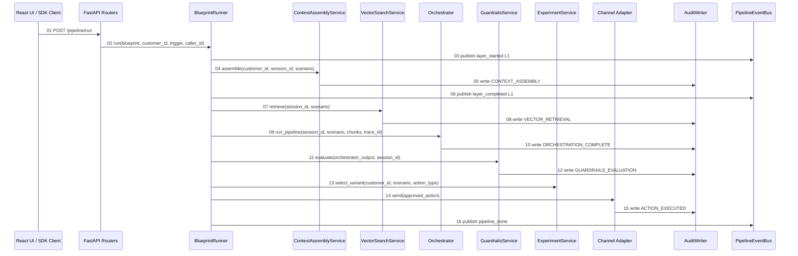

# Code Calling Guide

This document summarizes the major runtime entrypoints, call flow, and public
methods in the Banking Agentic AI Platform. It is written as a developer-facing
companion to the logical architecture: use it when you want to understand where
to call into the system, what each layer returns, and which methods call the
next layer.

## Top-Level Runtime Flow



## API Entrypoints

### `platform.api.main.app`

**Purpose:** FastAPI application root. Configures logging, tracing, CORS, API
routers, and Prometheus metrics.

**Registered routers:**
- `platform.api.routers.pipeline`
- `platform.api.routers.sse`
- `platform.api.routers.config`
- `platform.api.routers.outcomes`
- `platform.api.routers.audit`
- `platform.api.routers.experiments`
- `platform.api.routers.guardrails`
- `platform.api.routers.models`

**Health endpoint:**

```python
GET /health -> {"status": "ok"}
```

### `run_pipeline(request, runner)`

**File:** `platform/api/routers/pipeline.py`

**Route:** `POST /pipeline/run`

**Signature:**

```python
async def run_pipeline(
    request: PipelineRunRequest,
    runner: BlueprintRunner = Depends(get_runner),
) -> dict[str, str]
```

**Purpose:** Starts a pipeline run in a background task and immediately returns
the generated `trace_id`, `session_id`, and starting status.

**Called by:** React UI Pipeline Runner, API clients.

**Calls:**
- `blueprint_for_scenario(request.scenario)`
- `_run_background(...)`
- `BlueprintRunner.run(...)`

**Returns:** A small identifier payload:

```json
{
  "trace_id": "trace_sess_C002_...",
  "session_id": "sess_C002_...",
  "status": "started"
}
```

### `pipeline_status(trace_id, runner)`

**File:** `platform/api/routers/pipeline.py`

**Route:** `GET /pipeline/status/{trace_id}`

**Purpose:** Returns the latest in-memory status snapshot for a pipeline run.

**Returns:** A status dictionary containing fields such as `status`,
`customer_id`, `scenario`, `started_at`, `completed_at`, and
`execution_result` after completion.

### `pipeline_events(trace_id, runner)`

**File:** `platform/api/routers/sse.py`

**Route:** `GET /pipeline/events/{trace_id}`

**Purpose:** Streams retained and live server-sent events for a trace.

**Calls:** `runner.event_bus.stream(trace_id)`

**Event types:**
- `layer_started`
- `layer_completed`
- `layer_error`
- `pipeline_done`

### `record_outcome(trace_id, request, router_dependency)`

**File:** `platform/api/routers/outcomes.py`

**Route:** `POST /outcomes/{trace_id}`

**Purpose:** Records asynchronous customer outcomes such as push opens,
enrollments, opt-outs, or complaints.

**Calls:** `OutcomeRouter.route(outcome)`

## SDK Entrypoints

### `BlueprintRunner`

**File:** `platform/layer6_sdk/blueprint_runner.py`

**Purpose:** Main local orchestration surface. Runs all six platform layers and
emits lifecycle events for UI/SSE consumers.

#### `BlueprintRunner.run(...)`

**Signature:**

```python
async def run(
    self,
    blueprint: BlueprintConfig,
    customer_id: str,
    trigger: str,
    caller_id: str,
    session_id: str | None = None,
    trace_id: str | None = None,
) -> ExecutionResult
```

**Purpose:** Runs a blueprint from context assembly through execution.

**Call order:**
1. `ContextAssemblyService.assemble(...)`
2. `VectorSearchService.retrieve(...)`
3. `Orchestrator.run_pipeline(...)`
4. `GuardrailsService.evaluate(...)`
5. `BlueprintRunner._select_variants(...)`
6. `BlueprintRunner._execute_actions(...)`

**Returns:** `ExecutionResult`

**Side effects:**
- Writes status snapshots to `status_by_trace`
- Publishes SSE lifecycle events through `PipelineEventBus`
- Writes audit records through the configured `AuditWriter`
- Enqueues pending approval items for flagged actions

#### `BlueprintRunner._run_layer(...)`

**Purpose:** Wraps a layer call with `layer_started`, `layer_completed`, and
`layer_error` events.

**Notes:** This method is intentionally central because the UI architecture view
depends on its compact event summaries.

#### `BlueprintRunner._select_variants(...)`

**Purpose:** Applies Layer 5 experiment variants to approved actions before
execution. If no experiment exists for an action, the action passes through with
trace/session/customer metadata attached.

**Calls:** `ExperimentService.select_variant(...)`

#### `BlueprintRunner._execute_actions(...)`

**Purpose:** Executes the first approved action through the appropriate channel
adapter. If no actions are approved, returns a `PENDING_APPROVAL` result.

**Calls:**
- `_adapter_for_action(action)`
- `ChannelAdapter.send(action)`
- `AuditWriter.write(ACTION_EXECUTED)`

### `BankingAgenticAIClient`

**File:** `platform/layer6_sdk/client.py`

**Purpose:** Product-team SDK-style client for reading execution results and
recording outcomes.

#### `BankingAgenticAIClient.execute(trace_id, action_id, caller_id)`

**Purpose:** Returns an existing execution result from the runner status store.
In this local implementation, execution itself is performed by
`BlueprintRunner.run(...)`.

#### `BankingAgenticAIClient.record_outcome(...)`

**Purpose:** Converts SDK outcome input into an `OutcomeEvent` and routes it
through `OutcomeRouter`.

## Six-Layer Service Calls

### Layer 1: `ContextAssemblyService`

**File:** `platform/layer1_context/service.py`

**Primary method:**

```python
async def assemble(self, customer_id: str, session_id: str, scenario: str) -> AssemblyResult
```

**Purpose:** Builds a canonical `CustomerProfile` from card, banking, CRM,
behavioral, and feature-store sources.

**Calls:**
- `_fetch_with_timeout(adapter, customer_id, trace_id)`
- `pull_signals(customer_id, feature_store)`
- `normalize_customer_profile(...)`
- `ContextStore.set("session:{session_id}:customer_profile", ...)`
- `AuditWriter.write(CONTEXT_ASSEMBLY)`

**Returns:** `AssemblyResult`

**Important behavior:**
- Source adapters run concurrently.
- Adapter failures degrade the profile instead of failing the pipeline.
- The customer profile is stored with a TTL and later read by Layers 2-4.

### Layer 2: `VectorSearchService`

**File:** `platform/layer2_vector/service.py`

**Primary method:**

```python
async def retrieve(self, session_id: str, scenario: str, top_k: int = 3) -> RetrievalResult
```

**Purpose:** Loads the Layer 1 profile, builds a scenario-aware query, retrieves
policy chunks, reranks them, and writes retrieval evidence.

**Calls:**
- `_read_customer_profile(session_id)`
- `build_retrieval_query(profile, scenario)`
- `KnowledgeBaseLoader.load_and_index()`
- `HybridRetriever.search(...)`
- `CrossEncoderReranker.rerank(...)`
- `AuditWriter.write(VECTOR_RETRIEVAL)`

**Returns:** `RetrievalResult`

**Raises:**
- `SchemaValidationError` when `top_k <= 0`
- `SessionExpiredError` when Layer 1 context is missing

### Layer 3: `Orchestrator`

**File:** `platform/layer3_orchestration/orchestrator.py`

**Primary method:**

```python
async def run_pipeline(
    self,
    session_id: str,
    scenario: str,
    policy_chunks: list[PolicyChunk],
    trace_id: str,
) -> OrchestratorOutput
```

**Purpose:** Runs static hub-and-spoke agent pipelines. Agents propose actions
only; they do not execute them.

**Calls:**
- `_load_customer_profile(session_id)`
- `get_pipeline(scenario)`
- `_run_agent_step(...)`
- `_handle_branch(...)`
- `PipelineStateManager.checkpoint(...)`
- `_write_audit(result)`

**Returns:** `OrchestratorOutput`

**Failure routing:**
- Timeouts, schema validation errors, tool authorization errors, and pipeline
  errors route to `_route_failure(...)`.
- Failure routing creates a `HumanReviewItem` and returns an output with
  `status="HUMAN_REVIEW"`.

### Layer 4: `GuardrailsService`

**File:** `platform/layer4_guardrails/service.py`

**Primary method:**

```python
async def evaluate(
    self,
    orchestrator_output: OrchestratorOutput,
    session_id: str,
) -> GuardrailsResult
```

**Purpose:** Evaluates every proposed action before customer-facing execution.

**Call order per action:**
1. Regulatory YAML rules
2. Business policy YAML rules
3. Responsible-AI checks

**Calls:**
- `_read_profile(session_id)`
- `RuleLoader.get_rules()`
- `RuleEvaluator.evaluate(...)`
- `ConfidenceCheck.check(...)`
- `PartialContextCheck.check(...)`
- `ApprovalQueueService.enqueue(...)`
- `AuditWriter.write(GUARDRAILS_EVALUATION)`

**Returns:** `GuardrailsResult`

**Important behavior:**
- Regulatory blocks short-circuit later checks for that action.
- Flagged actions go to the approval queue.
- Only approved actions can reach Layer 5/6 execution.

### Layer 5: `ExperimentService`

**File:** `platform/layer5_ab/experiment_service.py`

#### `select_variant(customer_id, scenario, action_type)`

**Purpose:** Selects a variant by winner, qualified leader, or stable hash
bucket.

**Returns:** `ExperimentVariant`

**Used by:** `BlueprintRunner._select_variants(...)`

#### `record_outcome(experiment_id, variant_id, outcome)`

**Purpose:** Updates sample/conversion counts, recomputes confidence, and
concludes an experiment when confidence and sample-size thresholds are met.

**Returns:** `ExperimentResult`

**Used by:** `OutcomeProcessor` through `OutcomeRouter`

### Layer 6: Execution + Outcome Routing

#### `OutcomeRouter.route(outcome)`

**File:** `platform/layer6_sdk/outcome_router.py`

**Purpose:** Routes an outcome event to experiment processing, model governance
capture, and audit.

**Calls:**
- `OutcomeProcessor.record_outcome(outcome)`
- `model_governance_events.append(outcome)`
- `AuditWriter.write(OUTCOME_CAPTURED)`

## Infrastructure Factories

**File:** `platform/adapters/adapter_factory.py`

These functions centralize infrastructure selection:

| Function | Returns | Current behavior |
| --- | --- | --- |
| `create_context_store()` | `ContextStore` | Valkey-backed context store |
| `create_feature_store()` | `FeatureStore` | PostgreSQL feature store |
| `create_audit_writer()` | `AuditWriter` | PostgreSQL audit writer |
| `create_queue_store()` | `QueueStore` | PostgreSQL approval queue store |
| `create_vector_store()` | `VectorStore` | Qdrant vector store |
| `create_llm_client()` | `LLMClient` | Mock, Ollama, or LiteLLM based on runtime config |
| `create_channel_adapter(channel_type)` | `ChannelAdapter` | Mock SMS, push, or CRM adapter |

## Core Data Contracts

**File:** `platform/core/schemas.py`

Most cross-layer method signatures use these Pydantic models:

| Model | Produced by | Consumed by |
| --- | --- | --- |
| `CustomerProfile` | Layer 1 normalizer | Layers 2-4 |
| `AssemblyResult` | `ContextAssemblyService.assemble` | Runner/UI status |
| `RetrievalResult` | `VectorSearchService.retrieve` | Layer 3 |
| `AgentOutput` | Layer 3 agents | Orchestrator/branching |
| `OrchestratorOutput` | `Orchestrator.run_pipeline` | Layer 4 |
| `ProposedAction` | Agents | Guardrails, experiments, execution |
| `GuardrailsResult` | `GuardrailsService.evaluate` | Layer 5/6 |
| `ExperimentVariant` | `ExperimentService.select_variant` | Layer 5 action rewrite |
| `ExecutionResult` | `BlueprintRunner._execute_actions` | API/UI/SDK |
| `OutcomeEvent` | API/SDK outcome capture | `OutcomeRouter` |
| `AuditRecord` | All layers | Audit trail |

## Extension Points

### Add a New Scenario

1. Add or update a `BlueprintConfig` in `platform/layer6_sdk/blueprints.py`.
2. Add a static pipeline in `platform/layer3_orchestration/pipeline_registry.py`.
3. Add or reuse agents under `platform/layer3_orchestration/agents/`.
4. Add scenario-specific query terms in `platform/layer2_vector/query_builder.py`.
5. Add tests covering the new scenario through `BlueprintRunner.run(...)`.

### Add a New Guardrail

1. Add a YAML rule under `rules/`.
2. If YAML conditions are insufficient, add a responsible-AI/business check in
   `platform/layer4_guardrails/checks/`.
3. Wire the check into `GuardrailsService._evaluate_action(...)`.
4. Assert approved/flagged/blocked behavior in `tests/unit/test_layer4.py`.

### Add a Real Channel Adapter

1. Implement `ChannelAdapter.send(action)` from `platform/core/interfaces.py`.
2. Add selection logic in `platform/adapters/adapter_factory.py` or
   `_adapter_for_action(...)`.
3. Preserve `trace_id`, `action_id`, and delivery receipt metadata for audit.
4. Add adapter tests that verify receipt shape and failure handling.

## Quick Local Examples

### Run the Full Pipeline Directly

```python
from platform.layer6_sdk import BlueprintRunner, blueprint_for_scenario

runner = BlueprintRunner()
result = await runner.run(
    blueprint=blueprint_for_scenario("payment_risk_intervention"),
    customer_id="C002",
    trigger="manual",
    caller_id="developer",
)
print(result.trace_id, result.status)
```

### Stream Pipeline Events

```python
async for event in runner.event_bus.stream(trace_id):
    print(event.event_type, event.payload)
```

### Record an Outcome

```python
from datetime import UTC, datetime
from platform.core.schemas import OutcomeEvent
from platform.layer6_sdk.outcome_router import OutcomeRouter

router = OutcomeRouter(
    experiment_service=runner.experiment_service,
    audit_writer=runner.audit_writer,
)
await router.route(
    OutcomeEvent(
        outcome_id="out_example",
        trace_id=result.trace_id,
        action_id=result.action_id,
        customer_id="C002",
        outcome_type="ENROLLED",
        outcome_ts=datetime.now(UTC),
        metadata={"session_id": result.trace_id.replace("trace_", "")},
    )
)
```
