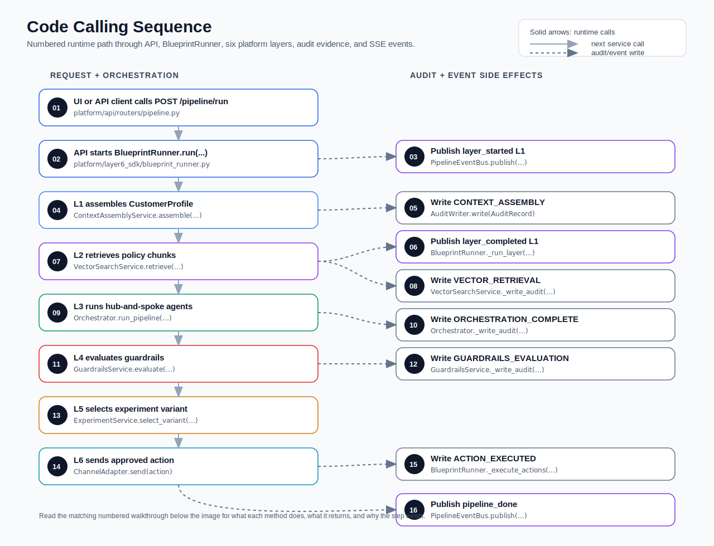

# Code Calling Guide

This document summarizes the major runtime entrypoints, call flow, and public
methods in the Banking Agentic AI Platform. It is written as a developer-facing
companion to the logical architecture: use it when you want to understand where
to call into the system, what each layer returns, and which methods call the
next layer.

## Top-Level Runtime Flow



## Numbered Code Flow Walkthrough

Use this section together with the numbered sequence diagram above. The goal is
to follow one pipeline run from the UI/API boundary through all six layers, while
knowing which file and method to open when you want to inspect the implementation.

### 01. UI calls `POST /pipeline/run`

**Code to read:** `platform/api/routers/pipeline.py`

The flow starts when a caller asks the platform to run a banking scenario for a
customer. In the UI, this is the Pipeline Runner page; for an API client, it is
the `POST /pipeline/run` endpoint.

The request body is represented by `PipelineRunRequest`:

```python
class PipelineRunRequest(BaseModel):
    customer_id: str
    scenario: str
    blueprint: str | None = None
    caller_id: str = "api"
    trigger: str = "api"
```

At this point, nothing has run yet. The API is just collecting the minimum
inputs needed to identify the customer, scenario, caller, and trigger source.

### 02. API starts `BlueprintRunner.run(...)`

**Code to read:** `run_pipeline(...)` and `_run_background(...)` in
`platform/api/routers/pipeline.py`, then `BlueprintRunner.run(...)` in
`platform/layer6_sdk/blueprint_runner.py`

The API creates a `session_id` and a `trace_id`, stores an initial
`status_by_trace` record, and starts `_run_background(...)` as an async task.
That background task calls:

```python
await runner.run(
    blueprint=blueprint,
    customer_id=request.customer_id,
    trigger=request.trigger,
    caller_id=request.caller_id,
    session_id=session_id,
    trace_id=trace_id,
)
```

This is the main handoff from API routing into the six-layer platform runtime.
From here on, `BlueprintRunner` is the conductor: it calls each layer in order,
records status, and emits live progress events.

### 03. Runner publishes `layer_started` for L1

**Code to read:** `BlueprintRunner._run_layer(...)`

Every layer call goes through `_run_layer(...)`. Before it calls the layer
method, it publishes:

```python
await self.event_bus.publish(
    trace_id,
    "layer_started",
    {"layer": layer, "timestamp": datetime.now(UTC).isoformat()},
)
```

This event is what lets the UI show that Layer 1 has started. The same pattern
is reused for every layer, so the UI does not need to understand each service
internally. It only listens to the event bus.

### 04. L1 assembles customer context

**Code to read:** `ContextAssemblyService.assemble(...)` in
`platform/layer1_context/service.py`

Layer 1 builds the canonical `CustomerProfile`. It fetches card, banking, CRM,
and behavioral data concurrently:

```python
fetch_results = await asyncio.gather(
    *[
        self._fetch_with_timeout(adapter, customer_id, trace_id)
        for adapter in self._source_adapters
    ]
)
```

Each adapter has a hard timeout. If CRM or another source is slow or down, the
profile is marked as partial instead of failing the whole run. That is why the
pipeline can keep moving with `partial_context=True` and `sources_degraded`
metadata.

After source fetches complete, Layer 1 pulls feature-store signals, normalizes
the raw data into `CustomerProfile`, and writes it to the context store under:

```text
session:{session_id}:customer_profile
```

This key is important. Layers 2, 3, and 4 use it to read the same session-scoped
profile.

### 05. L1 writes `CONTEXT_ASSEMBLY` audit evidence

**Code to read:** the audit write block inside
`ContextAssemblyService.assemble(...)`

Layer 1 writes an `AuditRecord` with event type `CONTEXT_ASSEMBLY`. This record
captures which sources succeeded, which degraded, adapter latencies, model
versions, profile hash, and TTL expiry.

Think of this as the first regulatory evidence checkpoint. Later, if someone
asks why a decision happened, this record proves what customer context was
available at decision time.

### 06. Runner publishes `layer_completed` for L1

**Code to read:** `BlueprintRunner._run_layer(...)`

After `assemble(...)` returns, `_run_layer(...)` measures latency and publishes
`layer_completed` with a compact output summary:

```python
await self.event_bus.publish(
    trace_id,
    "layer_completed",
    {
        "layer": layer,
        "latency_ms": latency_ms,
        "output_summary": _summary_for_output(output),
    },
)
```

The important design idea is separation: the UI gets enough data for progress
display, while full evidence stays in audit records.

### 07. L2 retrieves policy context

**Code to read:** `VectorSearchService.retrieve(...)` in
`platform/layer2_vector/service.py`

Layer 2 starts by reading the Layer 1 profile from the context store:

```python
profile = await self._read_customer_profile(session_id)
```

Then it builds a scenario-aware query from that profile:

```python
query = build_retrieval_query(profile, scenario)
```

That query is used for hybrid search over the YAML knowledge base. The service
combines dense embeddings, sparse BM25, metadata filters, and cross-encoder
reranking. The result is a `RetrievalResult` containing the top policy chunks
the agents should use.

### 08. L2 writes `VECTOR_RETRIEVAL` audit evidence

**Code to read:** `VectorSearchService._write_audit(...)`

Layer 2 writes the retrieved chunks, document versions, scores, model names,
knowledge-base version, and retrieval latency. This matters because agent output
must be explainable against the exact policy evidence retrieved at the time.

If an agent later proposes a hardship offer, the audit trail can show which
hardship policy chunks were available to that agent.

### 09. L3 runs the agent pipeline

**Code to read:** `Orchestrator.run_pipeline(...)` in
`platform/layer3_orchestration/orchestrator.py`

Layer 3 loads the customer profile, selects the static pipeline for the
scenario, then runs each agent step. Each agent gets an `AgentContext` that
contains:

- `session_id`
- `customer_id`
- `scenario`
- `trace_id`
- retrieved `policy_chunks`
- prior agent outputs
- authorized tools
- step timeout

The key design rule is that agents propose actions; they do not execute them.
Tool authorization and output schema validation happen in code, outside the
prompt.

If an agent times out, returns invalid schema, or attempts an unauthorized tool,
the orchestrator routes the run to human review instead of letting the bad
output continue silently.

### 10. L3 writes `ORCHESTRATION_COMPLETE` audit evidence

**Code to read:** `Orchestrator._write_audit(...)`

After the pipeline finishes, Layer 3 writes the complete `OrchestratorOutput`.
That includes agent outputs, branch decisions, proposed actions, approval
requirements, and orchestration latency.

This is the handoff point between reasoning and governance. The proposed actions
exist, but none have been sent to customers yet.

### 11. L4 evaluates guardrails

**Code to read:** `GuardrailsService.evaluate(...)` and
`GuardrailsService._evaluate_action(...)` in
`platform/layer4_guardrails/service.py`

Layer 4 reads the same customer profile and evaluates each `ProposedAction`.
Checks run in this order:

1. Regulatory rules
2. Business policy rules
3. Responsible-AI checks

Regulatory blocks short-circuit the rest of the checks for that action. Flagged
actions go to the approval queue. Only approved actions can continue toward
execution.

This is the most important safety boundary in the codebase: LLM output is not a
control plane. Guardrails authorize actions before anything customer-facing can
happen.

### 12. L4 writes `GUARDRAILS_EVALUATION` audit evidence

**Code to read:** `GuardrailsService._write_audit(...)`

Layer 4 writes which actions were evaluated, latency, rule versions, and every
check result. This gives compliance reviewers the rule-by-rule reason an action
was approved, flagged, or blocked.

Because rule IDs and versions are recorded, the audit trail can still explain a
decision even after YAML rules evolve later.

### 13. L5 selects experiment variants

**Code to read:** `BlueprintRunner._select_variants(...)` and
`ExperimentService.select_variant(...)`

The runner passes approved actions to Layer 5. For each action, the experiment
service tries to find an active experiment matching:

```text
scenario + action_type
```

If a winner already exists, it uses the winner. If a statistically qualified
leader exists, it uses the leader. Otherwise it uses stable hash assignment:

```python
assignment_bucket(customer_id, experiment.experiment_id)
```

The selected variant can rewrite the customer message while preserving the
original action metadata. This is how experimentation changes the treatment
without bypassing guardrails.

### 14. L6 sends the approved action

**Code to read:** `BlueprintRunner._execute_actions(...)` and
`_adapter_for_action(...)`

Layer 6 is the only layer that executes. It picks a channel adapter from the
approved action:

- SMS action -> `MockSMSAdapter`
- CRM action or create-case action -> `MockCRMAdapter`
- otherwise -> `MockPushAdapter`

Then it calls:

```python
receipt = await adapter.send(action)
```

The local implementation uses mock adapters, but the interface shape is the
same place where real push, SMS, email, or CRM integrations would plug in.

### 15. L6 writes `ACTION_EXECUTED` audit evidence

**Code to read:** the audit write block inside
`BlueprintRunner._execute_actions(...)`

After a channel adapter returns a delivery receipt, Layer 6 writes an
`ACTION_EXECUTED` audit record. The payload includes the action ID, caller ID,
delivery receipt, outcome tracking ID, experiment ID, and variant ID.

This ties together execution, experimentation, and future outcome capture.

If there are no approved actions, Layer 6 writes a no-action audit record and
returns an `ExecutionResult` with `status="PENDING_APPROVAL"`.

### 16. Runner publishes `pipeline_done`

**Code to read:** the end of `BlueprintRunner.run(...)`

Finally, the runner updates `status_by_trace`, publishes `pipeline_done`, and
returns the final `ExecutionResult`.

At this point:

- API callers can read status through `GET /pipeline/status/{trace_id}`
- UI clients see the SSE stream complete
- audit records contain the decision trail
- approval queue contains any flagged actions
- outcome capture can later call `POST /outcomes/{trace_id}`

This is why `trace_id` is threaded everywhere: it is the one handle that connects
runtime status, SSE events, audit records, action execution, and outcomes.

## API Entrypoints

### `platform.api.main.app`

**Purpose:** FastAPI application root. Configures logging, tracing, CORS, API
routers, and Prometheus metrics.

**Registered routers:**
- `platform.api.routers.pipeline`
- `platform.api.routers.sse`
- `platform.api.routers.config`
- `platform.api.routers.outcomes`
- `platform.api.routers.audit`
- `platform.api.routers.evaluation`
- `platform.api.routers.experiments`
- `platform.api.routers.guardrails`
- `platform.api.routers.models`

**Health endpoint:**

```python
GET /health -> {"status": "ok"}
```

### `run_pipeline(request, runner)`

**File:** `platform/api/routers/pipeline.py`

**Route:** `POST /pipeline/run`

**Signature:**

```python
async def run_pipeline(
    request: PipelineRunRequest,
    runner: BlueprintRunner = Depends(get_runner),
) -> dict[str, str]
```

**Purpose:** Starts a pipeline run in a background task and immediately returns
the generated `trace_id`, `session_id`, and starting status.

**Called by:** React UI Pipeline Runner, API clients.

**Calls:**
- `blueprint_for_scenario(request.scenario)`
- `_run_background(...)`
- `BlueprintRunner.run(...)`

**Returns:** A small identifier payload:

```json
{
  "trace_id": "trace_sess_C002_...",
  "session_id": "sess_C002_...",
  "status": "started"
}
```

### `pipeline_status(trace_id, runner)`

**File:** `platform/api/routers/pipeline.py`

**Route:** `GET /pipeline/status/{trace_id}`

**Purpose:** Returns the latest in-memory status snapshot for a pipeline run.

**Returns:** A status dictionary containing fields such as `status`,
`customer_id`, `scenario`, `started_at`, `completed_at`, and
`execution_result` after completion.

### `pipeline_events(trace_id, runner)`

**File:** `platform/api/routers/sse.py`

**Route:** `GET /pipeline/events/{trace_id}`

**Purpose:** Streams retained and live server-sent events for a trace.

**Calls:** `runner.event_bus.stream(trace_id)`

**Event types:**
- `layer_started`
- `layer_completed`
- `layer_error`
- `pipeline_done`

### `record_outcome(trace_id, request, router_dependency)`

**File:** `platform/api/routers/outcomes.py`

**Route:** `POST /outcomes/{trace_id}`

**Purpose:** Records asynchronous customer outcomes such as push opens,
enrollments, opt-outs, or complaints.

**Calls:** `OutcomeRouter.route(outcome)`

### Evaluation API

**File:** `platform/api/routers/evaluation.py`

**Routes:**
- `GET /evaluation/options`
- `POST /evaluation/run`
- `GET /evaluation/history`
- `GET /evaluation/judge-results`

**Purpose:** Runs and persists offline model evaluation before model promotion.
The current selectable evaluation candidates are:

| Model label | Model name |
| --- | --- |
| Payment Risk Model | `payment_risk_model` |
| Churn Propensity Model | `churn_propensity_model` |

`GET /evaluation/options` discovers versions from durable evaluation history,
MLflow model versions, and fallback version `1`. `POST /evaluation/run` calls
`EvaluationPipeline.run(...)`, which loads the local model artifact, executes
benchmark, fairness, and regression gates, tags MLflow best-effort, and stores
the report in PostgreSQL.

## SDK Entrypoints

### `BlueprintRunner`

**File:** `platform/layer6_sdk/blueprint_runner.py`

**Purpose:** Main local orchestration surface. Runs all six platform layers and
emits lifecycle events for UI/SSE consumers.

#### `BlueprintRunner.run(...)`

**Signature:**

```python
async def run(
    self,
    blueprint: BlueprintConfig,
    customer_id: str,
    trigger: str,
    caller_id: str,
    session_id: str | None = None,
    trace_id: str | None = None,
) -> ExecutionResult
```

**Purpose:** Runs a blueprint from context assembly through execution.

**Call order:**
1. `ContextAssemblyService.assemble(...)`
2. `VectorSearchService.retrieve(...)`
3. `Orchestrator.run_pipeline(...)`
4. `GuardrailsService.evaluate(...)`
5. `BlueprintRunner._select_variants(...)`
6. `BlueprintRunner._execute_actions(...)`

**Returns:** `ExecutionResult`

**Side effects:**
- Writes status snapshots to `status_by_trace`
- Publishes SSE lifecycle events through `PipelineEventBus`
- Writes audit records through the configured `AuditWriter`
- Enqueues pending approval items for flagged actions

#### `BlueprintRunner._run_layer(...)`

**Purpose:** Wraps a layer call with `layer_started`, `layer_completed`, and
`layer_error` events.

**Notes:** This method is intentionally central because the UI architecture view
depends on its compact event summaries.

#### `BlueprintRunner._select_variants(...)`

**Purpose:** Applies Layer 5 experiment variants to approved actions before
execution. If no experiment exists for an action, the action passes through with
trace/session/customer metadata attached.

**Calls:** `ExperimentService.select_variant(...)`

#### `BlueprintRunner._execute_actions(...)`

**Purpose:** Executes the first approved action through the appropriate channel
adapter. If no actions are approved, returns a `PENDING_APPROVAL` result.

**Calls:**
- `_adapter_for_action(action)`
- `ChannelAdapter.send(action)`
- `AuditWriter.write(ACTION_EXECUTED)`

### `BankingAgenticAIClient`

**File:** `platform/layer6_sdk/client.py`

**Purpose:** Product-team SDK-style client for reading execution results and
recording outcomes.

#### `BankingAgenticAIClient.execute(trace_id, action_id, caller_id)`

**Purpose:** Returns an existing execution result from the runner status store.
In this local implementation, execution itself is performed by
`BlueprintRunner.run(...)`.

#### `BankingAgenticAIClient.record_outcome(...)`

**Purpose:** Converts SDK outcome input into an `OutcomeEvent` and routes it
through `OutcomeRouter`.

## Six-Layer Service Calls

### Layer 1: `ContextAssemblyService`

**File:** `platform/layer1_context/service.py`

**Primary method:**

```python
async def assemble(self, customer_id: str, session_id: str, scenario: str) -> AssemblyResult
```

**Purpose:** Builds a canonical `CustomerProfile` from card, banking, CRM,
behavioral, and feature-store sources.

**Calls:**
- `_fetch_with_timeout(adapter, customer_id, trace_id)`
- `pull_signals(customer_id, feature_store)`
- `MLScoringService.score(profile)` when the artifact-backed scorer is enabled
- `MemoryStore.retrieve(customer_id, scenario)` for long-term customer memory
- `normalize_customer_profile(...)`
- `ContextStore.set("session:{session_id}:customer_profile", ...)`
- `AuditWriter.write(CONTEXT_ASSEMBLY)`

**Returns:** `AssemblyResult`

**Important behavior:**
- Source adapters run concurrently.
- Adapter failures degrade the profile instead of failing the pipeline.
- ML scoring overlays fixture signals when artifacts are available and falls
  back to feature-store signals when scoring fails.
- Long-term memory is attached to the profile when Qdrant memory retrieval is
  available; memory degradation is recorded in the assembly metadata.
- The customer profile is stored with a TTL and later read by Layers 2-4.

### Layer 2: `VectorSearchService`

**File:** `platform/layer2_vector/service.py`

**Primary method:**

```python
async def retrieve(self, session_id: str, scenario: str, top_k: int = 3) -> RetrievalResult
```

**Purpose:** Loads the Layer 1 profile, builds a scenario-aware query, retrieves
policy chunks, reranks them, and writes retrieval evidence.

**Calls:**
- `_read_customer_profile(session_id)`
- `build_retrieval_query(profile, scenario)`
- `KnowledgeBaseLoader.load_and_index()`
- `HybridRetriever.search(...)`
- `CrossEncoderReranker.rerank(...)`
- `AuditWriter.write(VECTOR_RETRIEVAL)`

**Returns:** `RetrievalResult`

**Raises:**
- `SchemaValidationError` when `top_k <= 0`
- `SessionExpiredError` when Layer 1 context is missing

### Layer 3: `Orchestrator`

**File:** `platform/layer3_orchestration/orchestrator.py`

**Primary method:**

```python
async def run_pipeline(
    self,
    session_id: str,
    scenario: str,
    policy_chunks: list[PolicyChunk],
    trace_id: str,
) -> OrchestratorOutput
```

**Purpose:** Runs static hub-and-spoke agent pipelines. Agents propose actions
only; they do not execute them.

**Calls:**
- `_load_customer_profile(session_id)`
- `get_pipeline(scenario)`
- `_run_agent_step(...)`
- `RoutedLLMInferenceService.complete(...)` inside each agent
- `_handle_branch(...)`
- `PipelineStateManager.checkpoint(...)`
- `_write_audit(result)`

**Returns:** `OrchestratorOutput`

**Failure routing:**
- Timeouts, schema validation errors, tool authorization errors, and pipeline
  errors route to `_route_failure(...)`.
- Failure routing creates a `HumanReviewItem` and returns an output with
  `status="HUMAN_REVIEW"`.

**LLM routing behavior:**
- Agents call the routed LLM inference service instead of calling providers
  directly.
- Runtime config selects `mock`, `ollama`, or `api` as the primary backend.
- Mock stays fast for deterministic tests; Ollama and API routes get larger
  task-specific latency budgets.
- Provider failures, schema failures, and timeouts fall back to the mock-safe
  backend and expose metadata such as primary backend/model, served
  backend/model, fallback reason, latency, and token estimates.
- Ollama requests send the Pydantic JSON Schema as the structured output
  contract so local models can return schema-valid JSON.

### Layer 4: `GuardrailsService`

**File:** `platform/layer4_guardrails/service.py`

**Primary method:**

```python
async def evaluate(
    self,
    orchestrator_output: OrchestratorOutput,
    session_id: str,
) -> GuardrailsResult
```

**Purpose:** Evaluates every proposed action before customer-facing execution.

**Call order per action:**
1. Regulatory YAML rules
2. Business policy YAML rules
3. Responsible-AI checks

**Calls:**
- `_read_profile(session_id)`
- `RuleLoader.get_rules()`
- `RuleEvaluator.evaluate(...)`
- `ConfidenceCheck.check(...)`
- `PartialContextCheck.check(...)`
- `ApprovalQueueService.enqueue(...)`
- `AuditWriter.write(GUARDRAILS_EVALUATION)`

**Returns:** `GuardrailsResult`

**Important behavior:**
- Regulatory blocks short-circuit later checks for that action.
- Flagged actions go to the approval queue.
- Only approved actions can reach Layer 5/6 execution.

### Layer 5: `ExperimentService`

**File:** `platform/layer5_ab/experiment_service.py`

#### `select_variant(customer_id, scenario, action_type)`

**Purpose:** Selects a variant by winner, qualified leader, or stable hash
bucket.

**Returns:** `ExperimentVariant`

**Used by:** `BlueprintRunner._select_variants(...)`

#### `record_outcome(experiment_id, variant_id, outcome)`

**Purpose:** Updates sample/conversion counts, recomputes confidence, and
concludes an experiment when confidence and sample-size thresholds are met.

**Returns:** `ExperimentResult`

**Used by:** `OutcomeProcessor` through `OutcomeRouter`

### Layer 6: Execution + Outcome Routing

#### `OutcomeRouter.route(outcome)`

**File:** `platform/layer6_sdk/outcome_router.py`

**Purpose:** Routes an outcome event to experiment processing, model governance
capture, and audit.

**Calls:**
- `OutcomeProcessor.record_outcome(outcome)`
- `model_governance_events.append(outcome)`
- `AuditWriter.write(OUTCOME_CAPTURED)`
- `MemoryWriter.write_from_outcome(outcome)` for durable customer memory

## Infrastructure Factories

**File:** `platform/adapters/adapter_factory.py`

These functions centralize infrastructure selection:

| Function | Returns | Current behavior |
| --- | --- | --- |
| `create_context_store()` | `ContextStore` | Valkey-backed context store |
| `create_feature_store()` | `FeatureStore` | PostgreSQL feature store |
| `create_audit_writer()` | `AuditWriter` | PostgreSQL audit writer |
| `create_queue_store()` | `QueueStore` | PostgreSQL approval queue store |
| `create_vector_store()` | `VectorStore` | Qdrant vector store |
| `create_memory_store()` | `MemoryStore` | Qdrant customer-memory store |
| `create_ml_scoring_service()` | `MLScoringService` | Local pickle artifact-backed scorer |
| `create_llm_client()` | `LLMClient` | Mock, Ollama, or LiteLLM based on runtime config |
| `create_llm_inference_service()` | `LLMInferenceService` | Routed LLM inference with timeout, fallback, and metadata |
| `create_channel_adapter(channel_type)` | `ChannelAdapter` | Mock SMS, push, or CRM adapter |

## PostgreSQL Tables

The application schema is defined by `alembic/versions/001_initial_schema.py`
and `alembic/versions/002_evaluation_history.py`. A migrated local database has
nine application tables plus Alembic metadata:

| Table | Purpose |
| --- | --- |
| `feature_store` | Customer feature and ML signal values used by Layer 1 context assembly. |
| `audit_log` | Immutable audit records emitted by the six-layer runtime. |
| `approval_queue` | Human-review items for flagged or approval-required actions. |
| `experiments` | A/B experiment definitions keyed by scenario and action type. |
| `experiment_variants` | Variant definitions and payload rewrites for each experiment. |
| `experiment_results` | Sample, conversion, confidence, and winner-tracking state. |
| `outcome_events` | Captured customer outcomes linked to traces, experiments, and variants. |
| `evaluation_reports` | Durable offline evaluation reports for candidate model versions. |
| `evaluation_judge_results` | Stored LLM judge scores, reasoning, flags, and raw payload. |
| `alembic_version` | Alembic migration bookkeeping table. |

Local seeding is handled by `platform/db_seed.py`. It upserts feature-store
fixtures and experiment metadata into `feature_store`, `experiments`,
`experiment_variants`, and `experiment_results`.

## Core Data Contracts

**File:** `platform/core/schemas.py`

Most cross-layer method signatures use these Pydantic models:

| Model | Produced by | Consumed by |
| --- | --- | --- |
| `CustomerProfile` | Layer 1 normalizer | Layers 2-4 |
| `AssemblyResult` | `ContextAssemblyService.assemble` | Runner/UI status |
| `RetrievalResult` | `VectorSearchService.retrieve` | Layer 3 |
| `AgentOutput` | Layer 3 agents | Orchestrator/branching |
| `OrchestratorOutput` | `Orchestrator.run_pipeline` | Layer 4 |
| `ProposedAction` | Agents | Guardrails, experiments, execution |
| `GuardrailsResult` | `GuardrailsService.evaluate` | Layer 5/6 |
| `ExperimentVariant` | `ExperimentService.select_variant` | Layer 5 action rewrite |
| `ExecutionResult` | `BlueprintRunner._execute_actions` | API/UI/SDK |
| `OutcomeEvent` | API/SDK outcome capture | `OutcomeRouter` |
| `AuditRecord` | All layers | Audit trail |

## Extension Points

### Add a New Scenario

1. Add or update a `BlueprintConfig` in `platform/layer6_sdk/blueprints.py`.
2. Add a static pipeline in `platform/layer3_orchestration/pipeline_registry.py`.
3. Add or reuse agents under `platform/layer3_orchestration/agents/`.
4. Add scenario-specific query terms in `platform/layer2_vector/query_builder.py`.
5. Add tests covering the new scenario through `BlueprintRunner.run(...)`.

### Add a New Guardrail

1. Add a YAML rule under `rules/`.
2. If YAML conditions are insufficient, add a responsible-AI/business check in
   `platform/layer4_guardrails/checks/`.
3. Wire the check into `GuardrailsService._evaluate_action(...)`.
4. Assert approved/flagged/blocked behavior in `tests/unit/test_layer4.py`.

### Add a Real Channel Adapter

1. Implement `ChannelAdapter.send(action)` from `platform/core/interfaces.py`.
2. Add selection logic in `platform/adapters/adapter_factory.py` or
   `_adapter_for_action(...)`.
3. Preserve `trace_id`, `action_id`, and delivery receipt metadata for audit.
4. Add adapter tests that verify receipt shape and failure handling.

## Quick Local Examples

### Run the Full Pipeline Directly

```python
from platform.layer6_sdk import BlueprintRunner, blueprint_for_scenario

runner = BlueprintRunner()
result = await runner.run(
    blueprint=blueprint_for_scenario("payment_risk_intervention"),
    customer_id="C002",
    trigger="manual",
    caller_id="developer",
)
print(result.trace_id, result.status)
```

### Stream Pipeline Events

```python
async for event in runner.event_bus.stream(trace_id):
    print(event.event_type, event.payload)
```

### Record an Outcome

```python
from datetime import UTC, datetime
from platform.core.schemas import OutcomeEvent
from platform.layer6_sdk.outcome_router import OutcomeRouter

router = OutcomeRouter(
    experiment_service=runner.experiment_service,
    audit_writer=runner.audit_writer,
)
await router.route(
    OutcomeEvent(
        outcome_id="out_example",
        trace_id=result.trace_id,
        action_id=result.action_id,
        customer_id="C002",
        outcome_type="ENROLLED",
        outcome_ts=datetime.now(UTC),
        metadata={"session_id": result.trace_id.replace("trace_", "")},
    )
)
```
