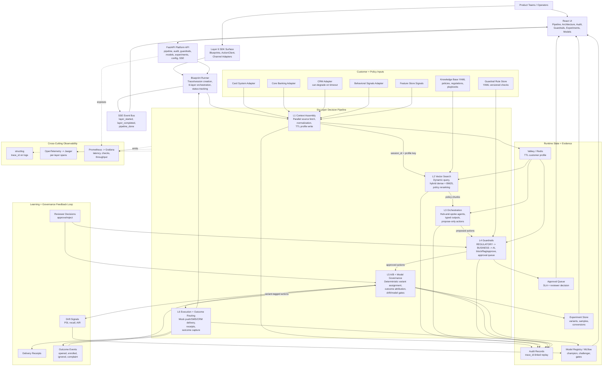

# Logical Architecture Diagram

Author: Sarala Biswal

This diagram shows the logical runtime shape of the Banking Agentic AI Platform.
It is intentionally not a deployment diagram: the boxes describe platform
responsibilities, service boundaries, data movement, and governance checkpoints.

## How To Read It

- **Northbound surfaces:** product teams use the SDK/API, while operators use
  the React UI for live runs, audit replay, approvals, experiments, and model
  governance.
- **Decision flow:** the six layers run in strict order. Agents only propose;
  guardrails authorize; Layer 6 executes.
- **Evidence flow:** every layer writes audit evidence tied to the same
  `trace_id`, which is what makes regulatory replay possible.
- **Feedback loop:** outcomes, reviewer decisions, and drift signals feed Layer
  5 governance so interventions can improve without bypassing compliance.

## Key Boundaries

| Boundary | Responsibility | Why It Exists |
| --- | --- | --- |
| UI/API boundary | Operators interact through typed API calls and SSE streams. | Keeps frontend state separate from platform orchestration. |
| Layer 1 context boundary | Source adapters normalize data into one customer profile. | Agents never depend on upstream system schemas. |
| Layer 3/4 governance boundary | Agents propose actions; guardrails authorize actions. | Prevents prompt behavior from becoming the control plane. |
| Layer 5/6 execution boundary | Experiments tag approved actions before delivery. | Keeps measurement and execution coupled but auditable. |
| Audit/observability boundary | Audit proves decisions; metrics/traces operate the system. | Separates regulatory replay from engineering telemetry. |

