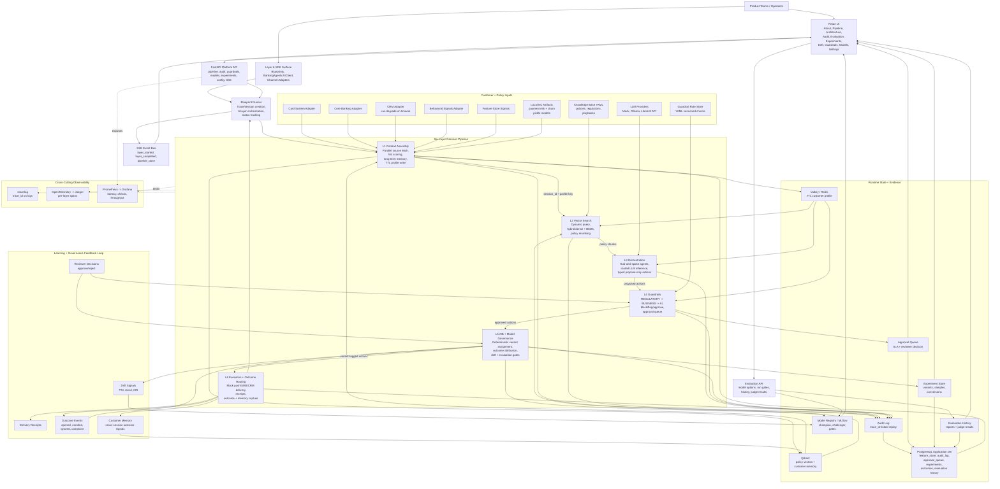

# Logical Architecture Diagram

Author: Sarala Biswal

This diagram shows the logical runtime shape of the Banking Agentic AI Platform.
It is intentionally not a deployment diagram: the boxes describe platform
responsibilities, service boundaries, data movement, and governance checkpoints.

## How To Read It

- **Northbound surfaces:** product teams use the SDK/API, while operators use
  the React UI for live runs, audit replay, offline evaluation, approvals,
  experiments, drift, model governance, architecture walkthroughs, and runtime
  LLM settings.
- **Decision flow:** the six layers run in strict order. Agents only propose;
  routed LLM inference produces typed agent outputs; guardrails authorize;
  Layer 6 executes.
- **Evidence flow:** every layer writes audit evidence tied to the same
  `trace_id`, while PostgreSQL keeps durable audit, approval, outcome,
  experiment, and evaluation history.
- **Feedback loop:** outcomes, reviewer decisions, customer memory, evaluation
  results, and drift signals feed Layer 5 governance so interventions can
  improve without bypassing compliance.

## Key Boundaries

| Boundary | Responsibility | Why It Exists |
| --- | --- | --- |
| UI/API boundary | Operators interact through typed API calls and SSE streams. | Keeps frontend state separate from platform orchestration. |
| Layer 1 context boundary | Source adapters, ML scoring, and memory normalize into one customer profile. | Agents never depend on upstream system schemas or raw memory/vector payloads. |
| Layer 3 inference boundary | Agents use routed LLM inference with schema validation, timeout budgets, fallback, and metadata. | Keeps provider behavior observable and prevents untyped LLM output from leaking downstream. |
| Layer 3/4 governance boundary | Agents propose actions; guardrails authorize actions. | Prevents prompt behavior from becoming the control plane. |
| Layer 5/6 execution boundary | Experiments tag approved actions before delivery and outcomes are routed back into governance/memory. | Keeps measurement and execution coupled but auditable. |
| Audit/observability boundary | Audit proves decisions; metrics/traces operate the system. | Separates regulatory replay from engineering telemetry. |

## Current Persistent Stores

| Store | Tables or Collections | Used By |
| --- | --- | --- |
| PostgreSQL | `feature_store`, `audit_log`, `approval_queue`, `experiments`, `experiment_variants`, `experiment_results`, `outcome_events`, `evaluation_reports`, `evaluation_judge_results` | Layer 1 signals, audit replay, approvals, experiments, outcomes, durable evaluation history |
| Valkey / Redis | `session:{session_id}:customer_profile`, Layer 3 checkpoints | Short-lived context handoff and orchestration recovery |
| Qdrant | `knowledge_base`, `customer_memory` | Policy retrieval and cross-session memory |
| MLflow | local or remote tracking URI | Training lineage, evaluation metrics, champion/challenger governance |

## Current Model and LLM Paths

- **Layer 1 ML scoring:** `MLScoringService` loads local payment-risk and
  churn-propensity artifacts when available and falls back to feature-store
  signals when scoring degrades.
- **Layer 3 LLM inference:** agents call `RoutedLLMInferenceService`, which
  routes to mock, Ollama, or LiteLLM API backends, applies backend-appropriate
  latency budgets, records primary/served model metadata, and falls back to the
  mock-safe backend on timeout or provider/schema failures.
- **Offline evaluation:** the Evaluation UI/API supports `payment_risk_model`
  and `churn_propensity_model`, discovers versions from MLflow plus prior
  evaluation history, runs benchmark/fairness/regression gates, and stores
  durable reports in PostgreSQL.
